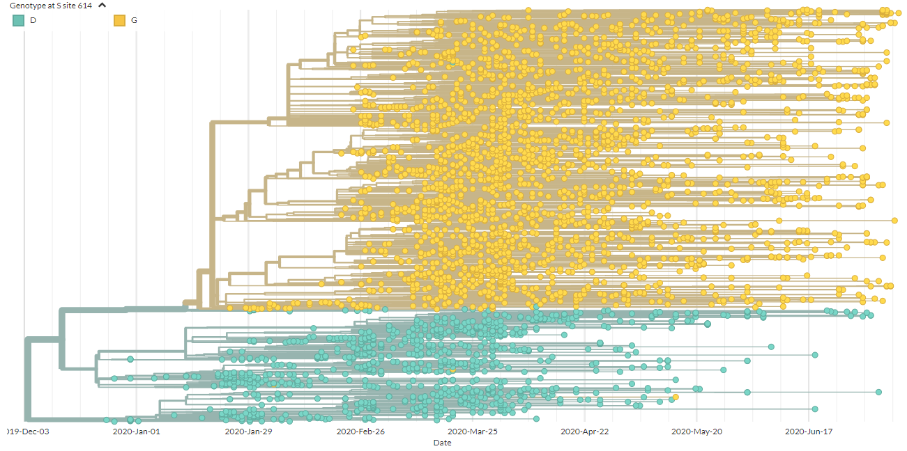
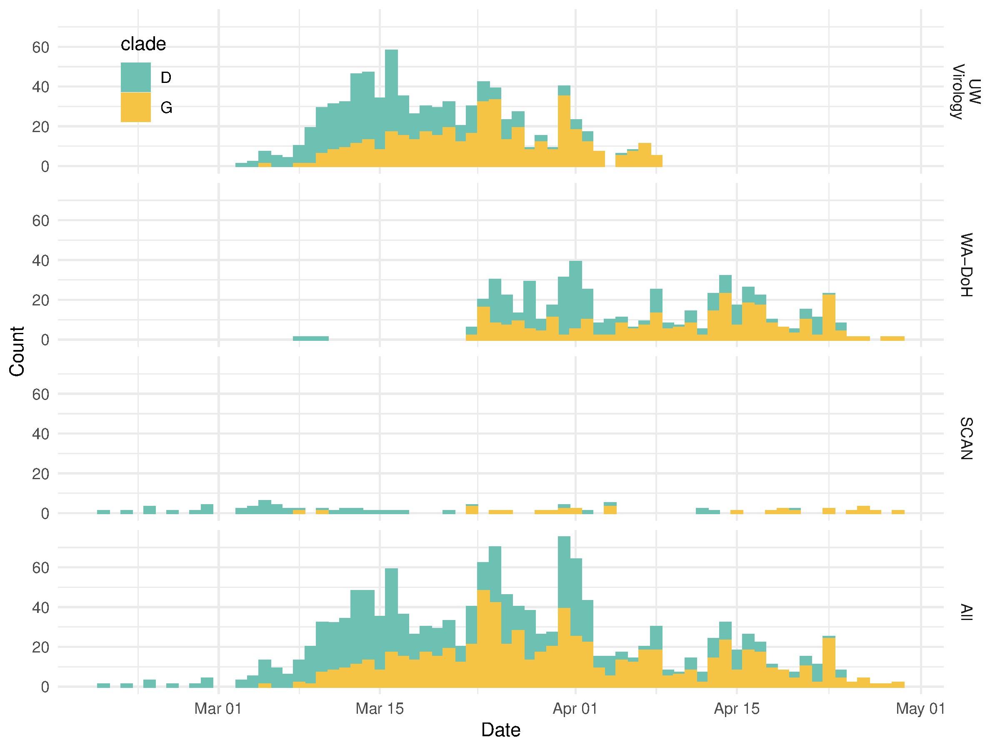
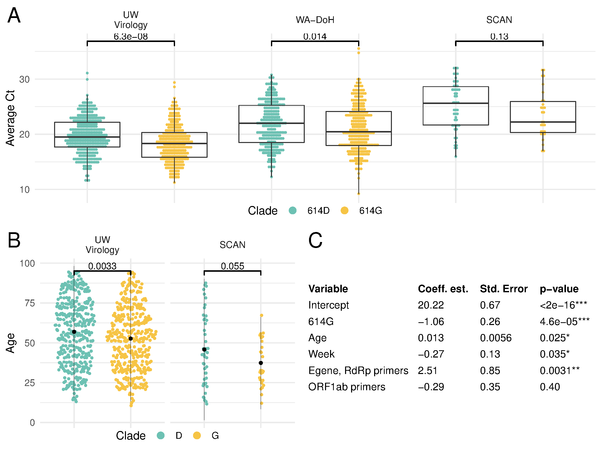
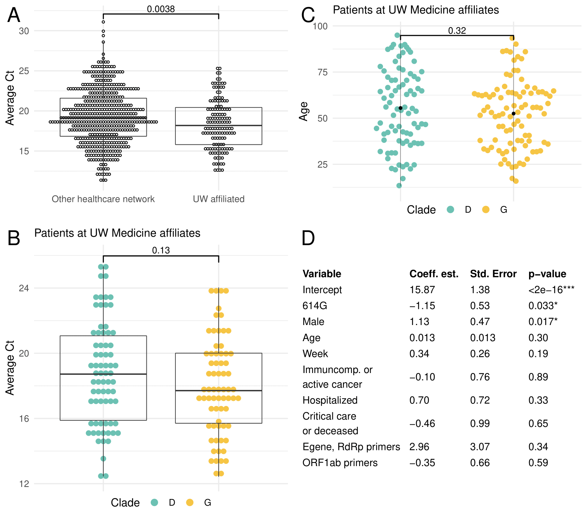
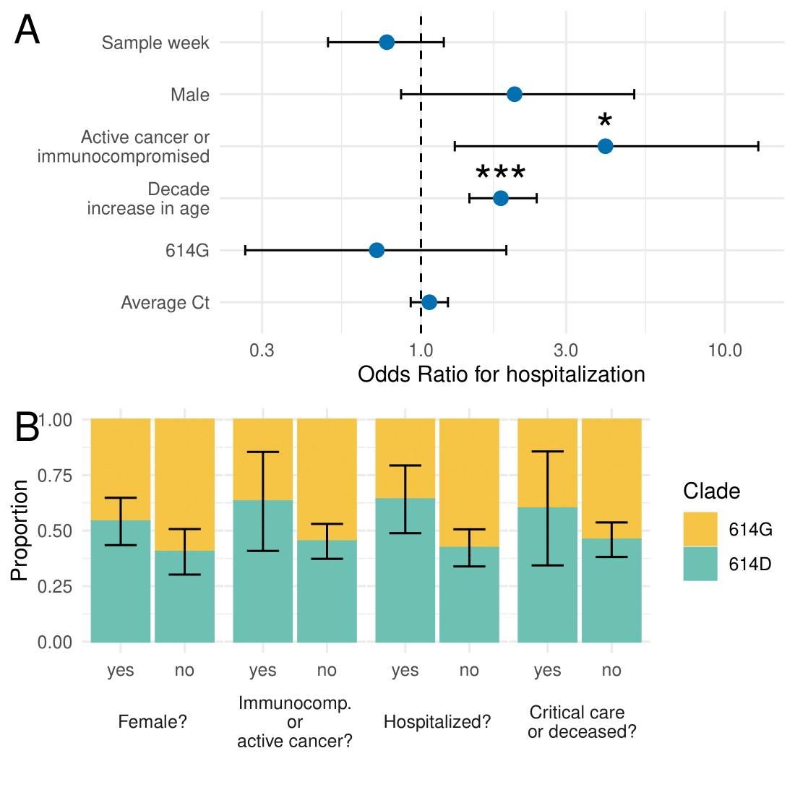

# Comparing viral load and clinical outcomes in Washington State across D614G substitution in spike protein of SARS-CoV-2

Cassia Wagner, Pavitra Roychoudhury, Chris D. Frazar, Jover Lee, Nicola F. Müller, Louise H. Moncla, James Hadfield, Emma B. Hodcroft,  Benjamin Pelle, Matthew Richardson, Caitlin Behrens, Meei-Li Huang, Patrick Mathias, Gregory Pepper, Lasata Shrestha, Hong Xie, Amin Addetia, Truong Nguyen, Victoria M Rachleff, Romesh Gautom, Geoff Melly, Brian Hiatt, Philip Dykema, Amanda Adler, Elisabeth Brandstetter, Peter D. Han, Kairsten Fay, Misja Ilcisin, Kirsten Lacombe, Thomas R. Sibley, Melissa Truong, Caitlin R. Wolf, Karen Cowgill, Stephanie Schrag, Jeff Duchin, Michael Boeckh, Janet A. Englund, Michael Famulare, Barry R. Lutz, Mark J. Rieder, Matthew Thompson, Richard A. Neher, Geoffrey S. Baird, Lea M. Starita, Helen Y. Chu, Jay Shendure, Scott Lindquist, Deborah A. Nickerson, Alexander L. Greninger, Keith R. Jerome, Trevor Bedford

Updated: July 22, 2020

The previous version from May 8, 2020 is [available here](https://github.com/blab/ncov-D614G/blob/39f87ba09a8e9ad1789052039f8602a445364b9e/README.md).
-------------------------------------------

Since its introduction into humans around the end of November or early December, SARS-CoV-2 has rapidly spread worldwide, wreaking havoc in the lives of many.
As the virus replicates, it has fixed mutations at a rate similar to other known RNA viruses (data from Nextstrain).
So far, there is only evidence for one major substitution in the viral spike protein.
As shown in the screenshot from [Nextstrain](https://nextstrain.org/ncov/global/2020-05-01?c=gt-S_614) below, this substitution, D614G, has arisen multiple times.
It initially appeared in viruses circulating in Europe but has since spread and is present in viruses in every region of the world.

 

<figure>
	
	
</figure>

 

Here, we use SARS-CoV-2 genomes from individuals in Washington State to explore whether or not the Spike: D614G substitution has any impact on replication potential of the virus or clinical outcomes of patients infected by the virus.
We find preliminary evidence of increased viral load and lower age of infection with viruses containing the D614G spike substitution.
We do not find convincing evidence for a difference in clinical outcomes among patients infected with viruses containing this substitution.  

## SARS-CoV-2 replication fitness assessed by viral load across D614G spike substitution

We analyzed 1437 SARS-CoV-2 genomes collected between February 20, 2020 and April 29, 2020 from individuals in Washington State.
808 genomes were from patients referred by a healthcare provider for nasal swab testing to the University of Washington (UW) Virology laboratory; 550 genomes were from samples collected by the Washington Department of Health (WA-DoH), and 79 samples were from self-collected nasal swabs mailed in for testing as part of the Seattle Coronavirus Assessment Network (SCAN).
These genomes were classified as belonging to clade D if they had an aspartic acid at position 614 in Spike or as belonging to clade G if they contained a glycine at Spike position 614.
726 sequences were classified into clade D, and 711 sequences were classified into clade G.
Early in the epidemic, the majority of circulating viruses belonged to clade D, but clade G viruses dominated later.
Notably, different sample sources had different time distributions of the viral lineages.
In UW Virology and SCAN samples, clade and time were highly correlated.
In WA-DoH samples, the clades were more evenly distributed over time (Fig. 1).

 

<figure>
	
	
  <figcaption>Figure 1: SARS-CoV-2 samples in Washington from Feb. 20, 2020 to April 29, 2020 Samples are classified into clades D or G according to amino acid at position 614 in the spike protein.
  </figcaption>
</figure>

  

We hypothesized that if D614G functionally improved virus replication, patients infected with 614G virus would have increased viral loads.
Using cycle threshold (Ct) from polymerase chain reaction (PCR) assays as a measurement of viral load, we found that patients with clade D viruses had an average higher Ct than patients with clade G viruses.
This difference was significant by Wilcoxon Rank Sum Test in samples from UW Virology (p-value = 6.3e-08, n = 648) and WA-DoH (p-value = 0.014, n = 550), but not when only using the samples from SCAN, where we had far fewer samples (p-value = 0.13, n = 79) (Fig. 2A).

Note: For UW Virology samples, only Ct from PCR with N1, N2 primers was considered in the above test. UW Virology Laboratory used three different primer sets over the timeframe of the dataset. The majority of samples were screened with N1, N2 primers, and these primers were used when both lineages were circulating in Washington.

We also found a difference in age of people infected between the two clades (Fig. 2B).  
In samples from UW Virology, the average age of patients infected with viruses from the 614D lineage was 56.9 and 52.7 for the 614G lineage (p-value= 0.0033, Student’s T-test).
In SCAN samples, the average age of patients was 45.8 for 614D and 37.4 for 614G (p-value = 0.055).
Age was not available for WA-DoH samples.
Note: Age was reported in a decade bin and converted to a continuous variable for analysis.

<figure>
	
	
  <figcaption>Figure 2: Cycle threshold (Ct) and viral clade. (A) Comparison between Ct values for viruses from 614D & 614G clade, (B) Comparison of patient age between 614D & 614G clade. Dots represent the mean and bars show two standard deviations from the mean. Age was reported in a decade bin vertically jittered for visualization. (C) GLM analysis of Ct values using different potential predictors.
  </figcaption>
</figure>

The lower age of infected patients with 614G virus could be due to increased viral load, resulting in more productive infections and more cases in younger, typically healthier individuals.
Age differences could also be caused by increased testing, resulting in detection of less severe, younger cases later in the outbreak when 614G was more prevalent (Fig. 1).
Similarly, differences in viral load between clades could also be due to increased testing, resulting in sooner detection of cases.
Viral load in patients strongly depends on when during an infection they are tested (He et al., 2020; Huang et al., 2020; Yu et al., 2020; Zou et al., 2020).
However, we observed differences in viral load across Spike D614G in three different datasets, spanning different time periods of the Washington State epidemic, so it seems less likely that Ct differences are solely due to time effects.

To further explore the relationship between clade, age, time, and Ct, we applied a generalized linear model to UW Virology samples.
As potential predictors, we included patient age, primers used in PCR, viral clade, and week in which a patient was tested.
We found that clade was the strongest predictor of Ct values, with 614G having a Ct value that is, on average, 1.06 units lower than for 614D (Fig. 2C).
Week and age had modest impacts on Ct values: a decade increase in age predicted a 0.13 increase in Ct, and with each additional week of the epidemic, predicted Ct decreased by 0.27.
The analysis suggests even that while controlling for differences in time and age, amino acid at position 614 in Spike is still a significant predictor of Ct.
This is consistent with increased replication potential being conferred by the Spike: D614G substitution

These findings are also consistent with observations by Korber et al in Sheffield, UK and McNamara et al in the southern United States finding lowered Ct's in patients with 614G virus compared to 614D virus.
Recent _in vitro_ studies identify a putative mechanism for differences in viral load: pseudovirus containing spike protein with 614G substitution exhibit less S1/S2 cleavage, resulting in increased protein stability and greater infectivity compared to 614D virus (Daniloski et al.; Zhang et al.; Yurkovetskiy et al., 2020).

## Clinical outcomes across SARS-CoV-2 D614G spike substitution

Increased viral replication due to Spike 614G could impact in clinical severity, so we examined the clinical records of patients with COVID-19.
We reviewed 175 charts of patients in the UW Medicine Network from whom sequenced SARS-CoV-2 genomes were sampled.
Clinical record review was limited to theses patients as the IRB only covered electronic health record access for patients in the UW Medicine Network.
In UW Medicine patients, samples were collected from March 5 and April 8; 82 of these patients were infected with SARS-CoV-2 from clade D, and 93 patients were infected with the clade G virus.
Table 1 summarizes the clinical variables pulled during chart review.

Table 1. Clinical characteristics of patients in the UW Medicine Network with SARS-CoV-2 genomes available.
| Sex        | Age                 | Status         | Care type       | Critical care admission | Active cancer or immunocompromised |
|------------|---------------------|----------------|-----------------|-------------------------|------------------------------------|
| Female: 86 | Range: 10-19 to 90+ | Deceased: 13   | Inpatient: 40   | Yes: 9                  | Yes: 19                            |
| Male: 89   | Median: 51-60       | Recovered: 162 | Outpatient: 135 | No: 165                 | No: 156                            |

 

Ct is lower for patients in UW Medicine network compared to other samples tested and sequenced by UW Virology (Fig 3A).
Since testing was performed by UW, it is possible that time to testing from symptom onset was shorter for patients seeking care in the UW Medicine network.

First, we repeated the analyses performed on all sequences in this subset of patients for whom clinical data was available.
As shown in Figure 3B, the Ct was again lower in patients with virus from clade G compared to clade D although this difference was not statistically significant (Wilcoxon Rank Sum Test: p-value 0.13).
The average age of patients with viruses from clade G compared to clade D was also lower but not significantly (Student's t-test: p-value 0.32) (Fig. 3C)

We performed the same GLM analysis as previously but included additional potential predictors, such as sex, active cancer or immunocompromised, hospitalization, and severe outcome (required intensive care and/or deceased).
In the GLM, viral clade was significantly associated with Ct values. Sex was also a significant predictor of Ct values, although none of the other variables were significant predictors (Fig. 3D)
With the small sample size, it is difficult to draw conclusions about the impact of the other variables on Ct.
However, the analysis did help validate that a lower Ct was observed with viruses from 614G clade in this dataset.

 

<figure>
	
	
  <figcaption>Figure 3: Average Ct, age, and clade for patients in UW Medicine Network. (A) Comparison of Ct for UW Medicine affiliated patients and other samples sequenced by UW Virology. (B) Comparison of Ct across Spike D614G in patients at UW Medicine affiliates. (C)  Comparison of patient age at UW Medicine affiliates between 614D & 614G clade. Dots represent the mean and bars show two standard deviations from the mean. Age was reported in a decade bin vertically jittered for visualization,. (D) GLM of Ct in patients at UW Medicine affiliates.
  </figcaption>
</figure>

  

We next investigated what factors impact clinical outcome most.
We grouped cases as either inpatient or outpatient and performed a multivariate logistic regression with hospitalization status as the outcome.
Clade membership, sex, immunocompromised/active cancer, age, week of testing and measured Ct value were potential predictors of the outcome.
The only significant predictors for hospitalization were age (p-value = 2.8e-06) and whether a patient was suffering from active cancer and/or was immunocompromised (p-value = 0.016).
We did not find any evidence for clade membership or Ct value to impact clinical outcome (Fig 4A).

Next, we used Chi-squared tests, to compare proportions of female vs. male, immunocompromised or active cancer, inpatient vs. outpatient, and critical care admission and/or death across clades.
After controlling for multiple hypothesis testing using a Bonferroni correction, there was no significant difference in viral clade across any of these variables (Fig. 4B).

<figure>
	
	
  <figcaption>Figure 4: Viral clade and clinical outcome. (A) Odds ratios of being hospitalized given being infected with SARS-CoV-2. (B) Proportion of viruses in 614D and 614G clades grouped by sex, immunocompromised status, hospitalization, and severe outcome (requiring critical care or death). Proportion was calculated as the mean of a binary clade variable; error bars show standard error of the mean.

  </figcaption>
</figure>

  

These results taken together find no evidence of a difference in clinical severity of COVID-19 due to the Spike D614G substitution in SARS-CoV-2.
Given the small sample size of our dataset however, this does not preclude the possibility that others may find a clinical difference in subsequent studies.

## References

Daniloski, Z. et al. (no date) ‘The Spike D614G mutation increases SARS-CoV-2 infection of multiple human cell types’. doi: 10.1101/2020.06.14.151357.
He, X. et al. (2020) ‘Temporal dynamics in viral shedding and transmissibility of COVID-19’, Nature medicine. Nature Publishing Group, 26(5), pp. 672–675.

Huang, Y. et al. (2020) ‘SARS-CoV-2 Viral Load in Clinical Samples from Critically Ill Patients’, American journal of respiratory and critical care medicine, pp. 1435–1438.

Korber, B. et al. (2020) ‘Tracking changes in SARS-CoV-2 Spike: evidence that D614G increases infectivity of the COVID-19 virus’, Cell. doi: 10.1016/j.cell.2020.06.043.

McNamara, R. P. et al. (no date) ‘High-density amplicon sequencing identifies community spread and ongoing evolution of SARS-CoV-2 in the Southern United States’. doi: 10.1101/2020.06.19.161141.

Müller, N. F. et al. (no date) ‘Characterising the epidemic spread of Influenza A/H3N2 within a city through phylogenetics’. doi: 10.1101/2020.04.27.052225.

Yu, F. et al. (2020) ‘Quantitative Detection and Viral Load Analysis of SARS-CoV-2 in Infected Patients’, Clinical infectious diseases: an official publication of the Infectious Diseases Society of America. doi: 10.1093/cid/ciaa345.

Yurkovetskiy, L. et al. (2020) ‘SARS-CoV-2 Spike protein variant D614G increases infectivity and retains sensitivity to antibodies that target the receptor binding domain’, bioRxiv : the preprint server for biology. doi: 10.1101/2020.07.04.187757.

Zhang, L. et al. (no date) ‘The D614G mutation in the SARS-CoV-2 spike protein reduces S1 shedding and increases infectivity’. doi: 10.1101/2020.06.12.148726.

Zou, L. et al. (2020) ‘SARS-CoV-2 Viral Load in Upper Respiratory Specimens of Infected Patients’, The New England journal of medicine, 382(12), pp. 1177–1179.
