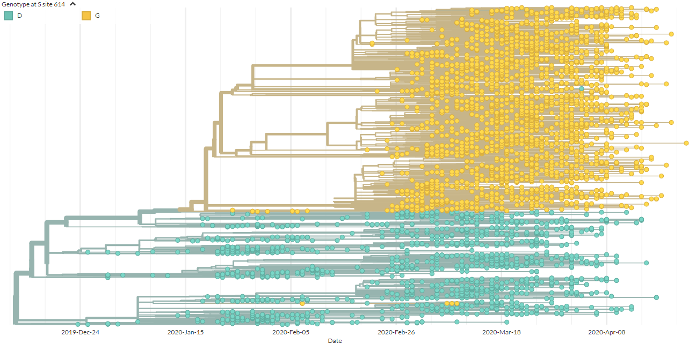
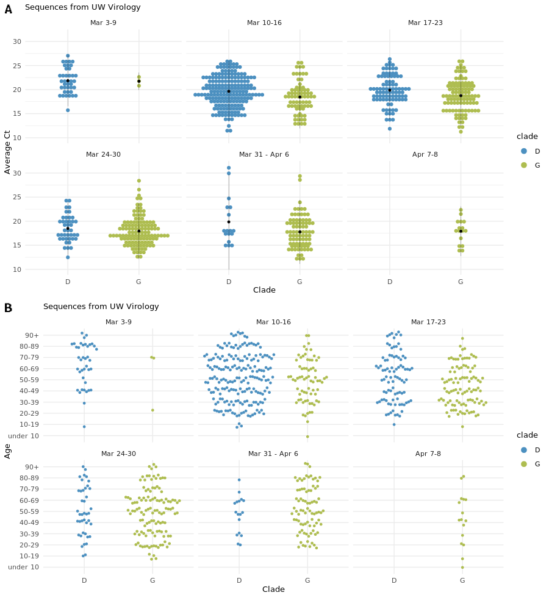
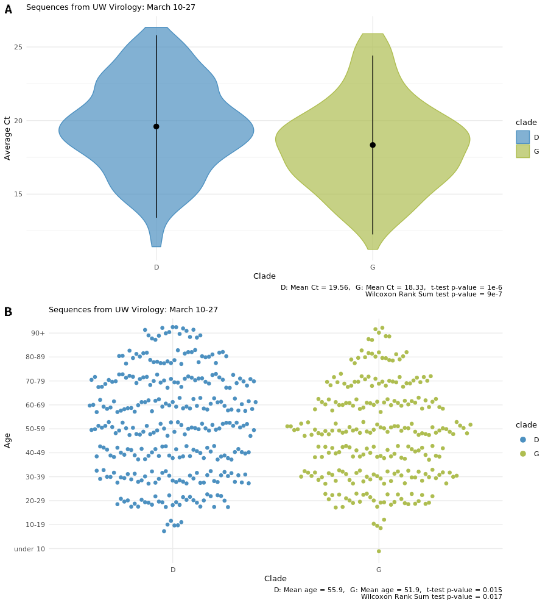
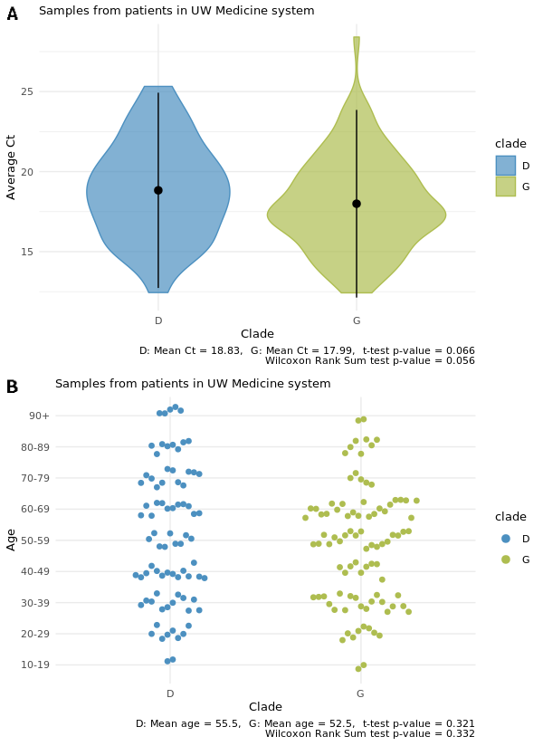

# Comparing viral load and clinical outcomes in Washington State across D614G mutation in spike protein of SARS-CoV-2

Cassia Wagner, Pavitra Roychoudhury, James Hadfield, Emma B. Hodcroft, Jover Lee, Louise H. Moncla, Nicola F. Müller, Caitlin Behrens, Meei-Li Huang, Patrick Mathias, Gregory Pepper, Lasata Shrestha, Hong Xie, Richard A. Neher, Geoffrey S. Baird, Alexander L. Greninger, Keith R. Jerome, Trevor Bedford

-------------------------------------------

Since its introduction into humans around the end of November or early December, SARS-CoV-2 has rapidly spread worldwide, wreaking havoc in the lives of many.
As the virus replicates, it has fixed mutations at a rate similar to other known RNA viruses (data from Nextstrain).
So far, there is only evidence for one major mutation in the viral spike protein.
As shown in the screenshot from [Nextstrain](https://nextstrain.org/ncov/global/2020-05-01?c=gt-S_614) below, this mutation, D614G, has arisen multiple times.
It initially appeared in viruses circulating in Europe but has since spread and is currently present in viruses in every region of the world.

 

<figure>
	
	
</figure>

 

Here, we use SARS-CoV-2 genomes from patients in Washington State to explore whether or not the Spike: D614G mutation has any impact on replication potential of the virus or clinical outcomes of patients infected by the virus.
We find preliminary evidence of increased viral load and lower age of infection for viruses with the D614G spike protein mutation. We do not find convincing evidence for a difference in clinical outcomes among patients infected with viruses containing this mutation.  

## SARS-CoV-2 replication fitness assessed by viral load and patient age across D614G spike protein mutation

We analyzed 808 SARS-CoV-2 genomes collected between March 3 and April 8 from patients in Washington.
These genomes were classified as belonging to clade D if they had an aspartic acid at position 614 in the viral spike protein or as belonging to clade G if they contained a glycine at spike protein position 614.
401 sequences were classified into clade D, and 407 sequences were classified into clade G.
Early in March, the majority of circulating viruses belonged to clade D, but clade G viruses dominated later in March. By early April, almost all sequences belonged to clade G (Fig. 1).

 

<figure>
	
	
  <figcaption>Figure 1: SARS-CoV-2 samples in Washington from March 3 to April 8. Samples are classified into clades D or G according to amino acid at position 614 in the spike protein.
  </figcaption>
</figure>

  

We hypothesized that if D614G functionally improved virus replication, patients infected with viruses containing this mutation would have increased viral loads.
Using cycle threshold (Ct) from polymerase chain reaction (PCR) assays as a measurement of viral load, we found that patients with clade D viruses had an average Ct of 19.81 while patients with clade G viruses had an average Ct of 18.23.
This difference in means was statistically significant by a Student's t-test (p-value: 4e-12).
The Wilcoxon Rank Sum test also identified a significant difference in Ct between clade G and clade D (p-value: 2e-12).

We also hypothesized that if D614G increased viral load, the average age of symptomatic patients would decrease.
With increased viral load, infected individuals would expose other people to higher doses of SARS-CoV-2. With an increased dose of the virus, younger, typically healthier, individuals would be more likely to develop an infection.

Among patients in Washington with sequenced SARS-CoV-2 genomes, we found a difference in average infected age across clade.
For clade D viruses, the average age of infected individuals was 56.9. For clade G viruses, the average age of infected individuals was 52.7.
These differences in age were significant by both Student's T-test (p-value: 0.003) and Wilcoxon Rank Sum test (p-value: 0.004).

Note: Age data was reported in a decade bin and converted to a continuous variable for analysis.

However, since time is correlated with clade (Fig. 1), we were concerned that the difference in age across clade could be due to time bias.
The Life Care Center, a nursing home in Kirkland, Washington, had an outbreak of COVID-19 in early March, and this could be biasing the average age of infection in clade D.
Additionally, in early March, we had only just become aware that SARS-CoV-2 was circulating in the community in Washington, so people presenting for clinical care might have more advanced infections and higher Ct's than patients later in the month.
We compared Ct and age across clade by time and found that early in March, the Ct and age were higher for both clades as compared to later timepoints (Fig. 2).

 

<figure>
	
	
  <figcaption>Figure 2: Age and average Ct by clade from March 3-April 8 (A) Horizontal dot plots of average Ct by clade over time. Black dots represent the mean and bars show two standard deviations from the mean. (B) Horizontal dot plots of age by clade over time. Age was given by decade bin and vertically jittered for visualization.
  </figcaption>
</figure>

  

Therefore, we decided to restrict the analysis to samples collected from March 10-27 as then viruses from both clades were circulating in Washington.
From samples collected between March 10-27, the average Ct was 19.56 for patients with viruses in clade D, and the average Ct was 18.33 for patients with viruses in clade G (Fig. 3A).
These difference in average Ct were significant by Student's t-test (p-value: 1e-06) and Wilcoxon Rank Sum test (p-value: 9e-07).

In this timeframe, the average age of patients with viruses in clade D was 55.9 and the average age was 51.9 for patients with viruses in clade G.
By Student's t-test and Wilcoxon Rank Sum test, these differences in age were significant at p-value's 0.015 and 0.017 respectively (Fig. 3B).

 

<figure>
	
	
  <figcaption>Figure 3: Average Ct and age by clade from March 10-27. (A) Violin plots of average Ct by clade for samples from patients in Washington between March 10-27. Dots represent the mean and bars show two standard deviations from the mean. (B) Horizontal dot plot of age by clade for samples from patients in Washington between March 10-27. Age was given by decade bin and vertically jittered for visualization.
  </figcaption>
</figure>

  

These are preliminary finding that requires further verification and should be followed by laboratory experiments comparing replication potential of these mutations _in vitro_.
However, the lower average Ct and lower age seen in patients with viruses in clade G is consistent with increased replication potential conferred by the Spike: D614G mutation.
If real, increased viral replication could impact in clinical severity, so we examined the clinical records of patients from whom the SARS-CoV-2 samples were collected.

## Clinical outcomes across SARS-CoV-2 D614G spike protein mutation

We reviewed 175 charts of patients in the UW Medicine Network from whom sequenced SARS-CoV-2 genomes were sampled.
Clinical record review was limited to theses patients as the IRB only covered electronic health record access for patients in the UW Medicine Network.
In UW Medicine patients, samples were collected from March 5 and April 8; 82 of these patients were infected with SARS-CoV-2 from clade D, and 93 patients were infected with the clade G virus.
Table 1 summarizes the clinical variables pulled during chart review.

Table 1. Clinical characteristics of patients in the UW Medicine Network with SARS-CoV-2 genomes available.
| Sex        | Age                 | Status         | Care type       | Critical care admission | Active cancer or immunocompromised |
|------------|---------------------|----------------|-----------------|-------------------------|------------------------------------|
| Female: 86 | Range: 10-19 to 90+ | Deceased: 13   | Inpatient: 40   | Yes: 9                  | Yes: 19                            |
| Male: 89   | Median: 51-60       | Recovered: 162 | Outpatient: 135 | No: 165                 | No: 156                            |

 

We repeated the analyses performed on all sequences in this subset of patients for whom clinical data was available.

As shown in Figure 4A, the average Ct for patients with viruses from clade D was 18.83, and the average Ct for patients with viruses from clade G was 17.99.
This was not a statistically significant difference, according to Student's t-test (p-value: 0.066) or Wilcoxon Rank Sum test (p-value: 0.056).
Considering the lower p-value's, it is possible that an actual difference in Ct exists, but we do not have enough samples to detect that difference.

The average age of patients with viruses from clade D was 55.5, and the average age of patients with viruses from clade G was 52.5 (Fig. 4B).
Again, this difference in age was not significant (Student's t-test: p-value 0.32, Wilcoxon Rank Sum test: p-value 0.33).

These p-values are quite large, so it is unlikely that with increased samples we would detect a difference in age for patients with the Spike: D614G mutation.
However, the UW Medicine Network and the patients it serves are distinct from other healthcare systems in Washington.
The patients served by UW Medicine may not represent the larger patient population in Washington.
Thus, the absence of an age difference in patients infected with viruses from clade G vs. clade D in this subset of individuals does not necessarily discount the result from a larger dataset.

 

<figure>
	
	
  <figcaption>Figure 4: Average Ct and age by clade for patients in UW Medicine Network. (A) Violin plots of average Ct by clade for samples from patients in the UW Medicine system. Dots represent the mean and bars show two standard deviations from the mean. (B) Horizontal dot plot of age by clade for samples from patients in UW Medicine System. Age was reported by decade bin and vertically jittered for visualization.
  </figcaption>
</figure>

  

Next, we used Chi-squared tests, or where appropriate the Fisher Exact test, to compare proportions of female vs. male, immunocompromised or active cancer, deceased, inpatient vs. outpatient, and critical care admission across clades.
There was no statistically significant difference in female vs. male by clade (p-value: 0.11), nor was there a significant difference in the proportion of immunocompromised patients or patients with active cancer by clade (p-value: 0.21).
These results were expected.
In immunocompromised individuals the virus already has a comparative advantage with host defenses down, so an increase in viral fitness would be less likely to be observed.

There was also no statistically significant difference in the proportion of deceased (p-value: 0.81) or who required critical care (p-value: 0.74) across clade.
Not all patients who die from COVID-19 are placed in critical care, however; some patients with other advanced conditions choose to focus on comfort care rather than pursuing aggressive treatment.
Therefore, we lumped patients who died from COVID-19 or who required critical care and performed a Chi-Squared test, and still no found no statistically significant difference across clade (p-value: 0.44).

We did find a significant difference in proportion of inpatient vs. outpatient across clade (p-value = 0.038)
The proportion of inpatient individuals with a virus in clade D was 0.30, and the proportion of inpatient individuals with a virus in clade G was 0.16.

Clade D definitely precedes clade G in time, and it's possible that physicians had a lower clinical threshold for hospitalization early in the outbreak as compared to later, which would explain this difference.
Restricting the data to samples to collected between March 10-27, the same time frame used to analyzed all sequences data, we found no significant difference in the proportion inpatient vs. outpatient by clade (p-value: 0.24).

These results taken together suggest that we find no difference in clinical severity of COVID-19 due to the spike mutation D614G in SARS-CoV-2.
